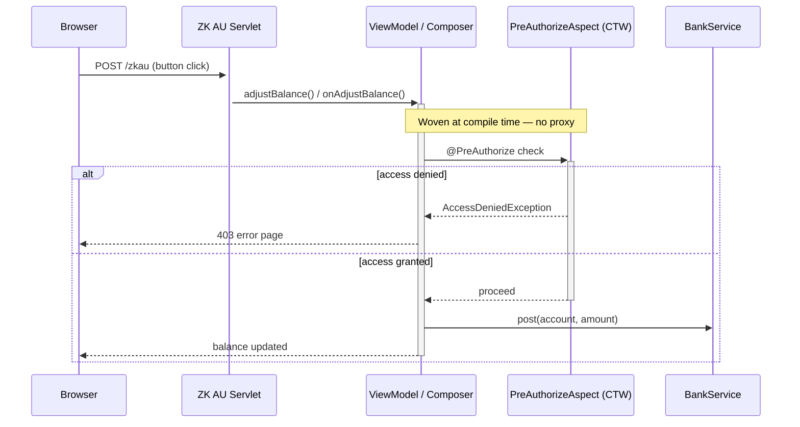
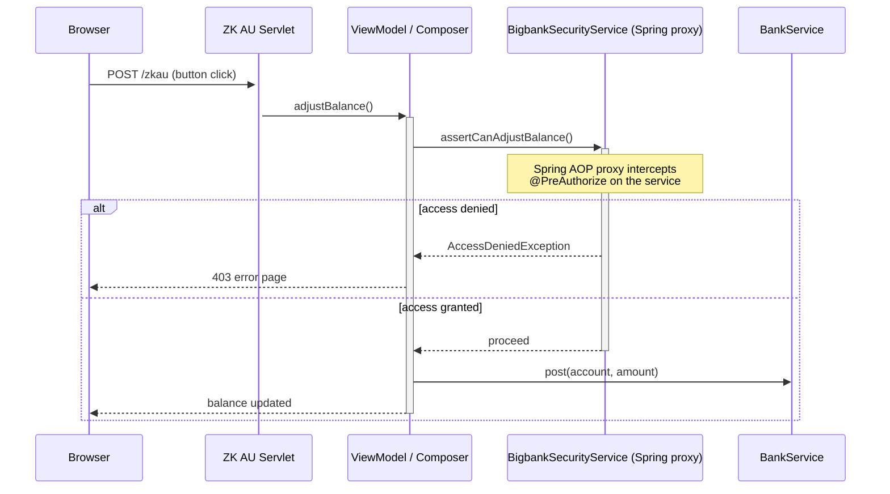
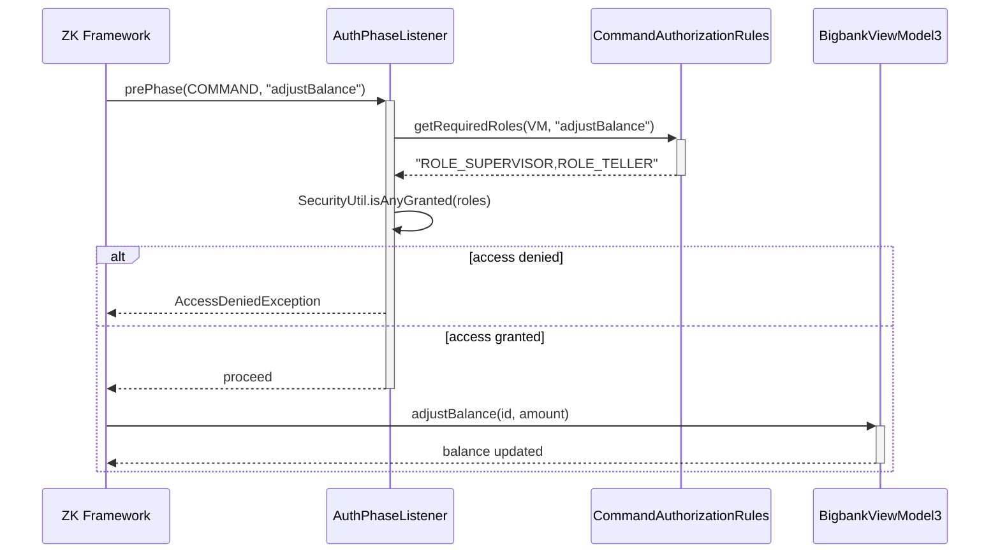
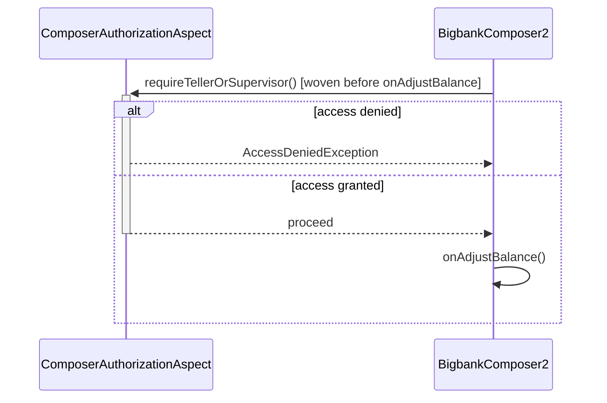

# ZK Authorization: MVC & MVVM Patterns

## The Core Problem

ZK's `/zkau` endpoint is a single HTTP entry point — URL-based Spring Security rules (e.g. `requestMatchers("/zkau").hasRole(...)`) can only gate the entire endpoint, not individual event handlers or commands. Every `onClick`, `@Listen`, or `@Command` handler is independently reachable from the browser and must be individually authorized.

---

## Recommended Architecture: Two-Layer Defense

```
Browser → /zkau → [1] Controller/ViewModel layer (fast fail, visible to developers)
                    ↓
               [2] Service layer (@PreAuthorize — the real security gate)
```

**Layer 1** (controller/ViewModel) is a developer-facing guard that provides clear error semantics at the boundary closest to the UI. **Layer 2** is mandatory defense-in-depth — it works even if layer 1 is forgotten, miscoded, or bypassed by future refactors.

---

## The CGLIB Proxy Problem

When any Spring-managed bean has a method annotated with `@PreAuthorize` (or any Spring AOP advice), Spring Security wraps it in a **CGLIB proxy**. This breaks ZK annotation scanning:

### What CGLIB does to overridden methods

```
BigbankViewModel$$SpringCGLIB$$0  extends  BigbankViewModel
  └── adjustBalance(Long, Double)   ← overridden for AOP interception
        method-level annotations:   [@Command]           ← Spring CGLIB *copies* these ✓
        parameter annotations:      [nothing, nothing]   ← CGLIB does NOT copy these ✗
```

Spring 5+ CGLIB copies method-level annotations to the proxy's generated overrides. But it **does not copy parameter annotations** — this is a bytecode generation limitation; parameter annotations live in a separate JVM attribute (`RuntimeVisibleParameterAnnotations`) that CGLIB's ASM-generated code does not reproduce.

### Net result for ZK

| ZK annotation | Through CGLIB proxy? |
|---|---|
| `@Command` (method-level) | **Yes** — command IS invoked |
| `@BindingParam` (parameter-level) | **No** — parameters arrive as `null` |
| `@Listen` (method-level) | **Yes** — works fine for MVC Composers |

**Conclusion:** Putting Spring AOP advice on a ViewModel method makes `@BindingParam` parameters null. The command fires but receives no data. MVC Composers are not affected since `@Listen` handlers use `MouseEvent` (no parameter annotations).

---

## Solution: AspectJ Compile-Time Weaving (CTW) with `spring-security-aspects`

AspectJ CTW injects advice directly into bytecode at build time. No proxy class is generated; ZK sees the original class with all annotations intact.

The `spring-security-aspects` library provides `PreAuthorizeAspect` — a standard AspectJ aspect that intercepts `@PreAuthorize` at compile time. This replaces any need for custom aspect classes.



### Key Configuration

#### pom.xml — Dependencies

```xml
<dependency>
    <groupId>org.aspectj</groupId>
    <artifactId>aspectjweaver</artifactId>
    <version>1.9.22</version>
</dependency>
<dependency>
    <groupId>org.aspectj</groupId>
    <artifactId>aspectjrt</artifactId>
    <version>1.9.22</version>
</dependency>
<dependency>
    <groupId>org.springframework.security</groupId>
    <artifactId>spring-security-aspects</artifactId>
    <version>${springsecurity.version}</version>
</dependency>
```

#### pom.xml — AspectJ Maven Plugin

```xml
<plugin>
    <groupId>org.codehaus.mojo</groupId>
    <artifactId>aspectj-maven-plugin</artifactId>
    <version>1.15.0</version>
    <dependencies>
        <dependency>
            <groupId>org.aspectj</groupId>
            <artifactId>aspectjtools</artifactId>
            <version>1.9.22</version>
        </dependency>
    </dependencies>
    <configuration>
        <complianceLevel>17</complianceLevel>
        <source>17</source>
        <target>17</target>
        <showWeaveInfo>true</showWeaveInfo>
        <encoding>UTF-8</encoding>
        <Xlint>ignore</Xlint>
        <aspectLibraries>
            <aspectLibrary>
                <groupId>org.springframework.security</groupId>
                <artifactId>spring-security-aspects</artifactId>
            </aspectLibrary>
        </aspectLibraries>
    </configuration>
    <executions>
        <execution>
            <goals><goal>compile</goal></goals>
        </execution>
    </executions>
</plugin>
```

#### SecurityConfig.java — Disable Spring AOP method security

```java
@EnableGlobalMethodSecurity(securedEnabled = true, prePostEnabled = true, mode = AdviceMode.ASPECTJ)
```

**Critical:** `mode = AdviceMode.ASPECTJ` tells Spring Security NOT to create CGLIB proxies for method security. Without this, both CTW and Spring AOP would intercept `@PreAuthorize` — the CGLIB proxy would still strip `@BindingParam` annotations.

### MVVM Pattern

```java
@Component
@Scope("prototype")
public class BigbankViewModel2 {

    @Autowired private BankService bankService;
    private ListModelList<Account> accounts;

    @PostConstruct
    public void init() {
        accounts = new ListModelList<>(bankService.findAccounts());
    }

    @Command
    @PreAuthorize("hasAnyRole('SUPERVISOR', 'TELLER')")
    public void adjustBalance(@BindingParam("accountId") Long id,
                              @BindingParam("amount") Double amount) {
        final Account account = bankService.readAccount(id);
        account.setBalance(bankService.post(account, amount).getBalance());
        BindUtils.postNotifyChange(null, null, account, "balance");
    }

    public ListModelList<Account> getAccounts() { return accounts; }
}
```

### MVC Pattern (SelectorComposer)

```java
@Component
@Scope("prototype")
public class BigbankComposer extends SelectorComposer<Window> {

    @Autowired private BankService bankService;
    @Wire private Grid accountGrid;
    private ListModelList<Account> accounts;

    @Override
    public void doAfterCompose(Window comp) throws Exception {
        super.doAfterCompose(comp);
        accounts = new ListModelList<>(bankService.findAccounts());
        accountGrid.setModel(accounts);
    }

    @Listen("onClick = #accountGrid row button")
    @PreAuthorize("hasAnyRole('SUPERVISOR', 'TELLER')")
    public void onAdjustBalance(MouseEvent event) {
        Button btn = (Button) event.getTarget();
        long accountId = ((Number) btn.getAttribute("accountId")).longValue();
        double amount = Double.parseDouble(btn.getAttribute("amount").toString());

        Account account = bankService.readAccount(accountId);
        account.setBalance(bankService.post(account, amount).getBalance());

        // Update the balance label directly instead of replacing the model item,
        // because accounts.set() re-renders the row, creating new buttons without @Listen bindings.
        Row row = (Row) btn.getParent();
        ((Label) row.getChildren().get(2)).setValue(String.valueOf(account.getBalance()));
    }
}
```

**MVC note:** `@Listen` in `SelectorComposer` binds to components at `doAfterCompose` time. If you replace a model item via `ListModelList.set()`, the row re-renders and creates new buttons without the listener binding. Update the UI directly instead.

---

## Alternative: Explicit Delegate Call (no build plugin required)

If you don't want the AspectJ Maven plugin, delegate to a separate `@Service` that carries `@PreAuthorize`. Spring proxies the service safely (no ZK annotations involved).



```java
@Service
public class BigbankSecurityService {
    @PreAuthorize("hasRole('ROLE_SUPERVISOR') or hasRole('ROLE_TELLER')")
    public void assertCanAdjustBalance() { }
}

@Component
@Scope("prototype")
public class BigbankViewModel {
    @Autowired private BankService bankService;
    @Autowired private BigbankSecurityService securityService;

    @Command
    public void adjustBalance(@BindingParam("accountId") Long id,
                              @BindingParam("amount") Double amount) {
        securityService.assertCanAdjustBalance();   // throws AccessDeniedException if denied
        // ... business logic
    }
}
```

---

---

## Authorization at Scale: Centralized Rules

The solutions above annotate each handler individually. When a ViewModel or Composer grows to dozens of commands, or when the same role constraint applies across an entire class or package, a centralized rule approach is more maintainable.

---

### Solution 3: PhaseListener — Centralized MVVM Command Authorization

ZK MVVM's binder fires a lifecycle event before every `@Command` executes. Registering a `PhaseListener` at `Phase.COMMAND` lets you intercept all commands in one place, check a centralized rule table, and throw `AccessDeniedException` before the ViewModel method is ever called.

This is the MVVM equivalent of Spring Security's `requestMatchers`: rules live in one class, the ViewModel stays annotation-free.

**Example ZUL page:** [`WEB-INF/zul/listAccounts4.zul`](src/main/webapp/WEB-INF/zul/listAccounts4.zul)

#### How it works



#### CommandAuthorizationRules — the rule table

```java
@Service
public class CommandAuthorizationRules {

    // Map<ViewModel class, Map<command name, comma-separated required roles>>
    // "*" acts as a wildcard fallback for any unmatched command.
    private final Map<Class<?>, Map<String, String>> rules = new HashMap<>();

    public CommandAuthorizationRules() {
        Map<String, String> vm3Rules = Map.of(
                "adjustBalance", "ROLE_SUPERVISOR,ROLE_TELLER",
                "*",             "ROLE_USER");
        rules.put(BigbankViewModel3.class, vm3Rules);
    }

    public Optional<String> getRequiredRoles(Class<?> viewModelClass, String commandName) {
        Map<String, String> classRules = rules.get(viewModelClass);
        if (classRules == null) return Optional.empty();
        String specific = classRules.get(commandName);
        if (specific != null) return Optional.of(specific);
        return Optional.ofNullable(classRules.get("*"));
    }
}
```

#### AuthPhaseListener — the interceptor

```java
public class AuthPhaseListener implements PhaseListener {

    @Override
    public void prePhase(Phase phase, BindContext ctx) {
        if (phase != Phase.COMMAND && phase != Phase.GLOBAL_COMMAND) return;

        Object vm = ctx.getBinder().getViewModel();
        String commandName = ctx.getCommandName();

        CommandAuthorizationRules rules =
                SpringUtil.getApplicationContext().getBean(CommandAuthorizationRules.class);
        Optional<String> requiredRoles = rules.getRequiredRoles(vm.getClass(), commandName);

        if (requiredRoles.isEmpty()) return;

        if (!SecurityUtil.isAnyGranted(requiredRoles.get())) {
            throw new AccessDeniedException(
                    "Access denied for command '" + commandName + "' on " + vm.getClass().getSimpleName());
        }
    }

    @Override
    public void postPhase(Phase phase, BindContext ctx) { }
}
```

Register the listener in `zk.xml`:

```xml
<library-property>
    <name>org.zkoss.bind.PhaseListener.class</name>
    <value>com.example.security.AuthPhaseListener</value>
</library-property>
```

#### ViewModel — no security annotations needed

**Key advantage:** `@BindingParam` parameters are never at risk — the PhaseListener intercepts inside the binder, before ZK performs parameter binding and method reflection. No CGLIB proxy is involved.

---

### Solution 4: AspectJ Pointcut — Centralized MVC Composer Authorization

For MVC `SelectorComposer`, AspectJ pointcut expressions provide the same centralized rule style. A single `@Aspect` class declares which classes or packages require which roles — no `@PreAuthorize` on any Composer method.

This is the direct ZK equivalent of Spring Security's `requestMatchers("/admin/**")`: the pointcut type pattern maps naturally to class and package boundaries.

**Example ZUL page:** [`WEB-INF/zul/listAccounts5.zul`](src/main/webapp/WEB-INF/zul/listAccounts5.zul)



#### ComposerAuthorizationAspect — the rule class

```java
@Aspect
public class ComposerAuthorizationAspect {

    // All @Listen methods on BigbankComposer2 require SUPERVISOR or TELLER.
    @Before("execution(@org.zkoss.zk.ui.select.annotation.Listen * " +
            "org.zkoss.zkspringessentials.bigbank.web.BigbankComposer2.*(..))")
    public void requireTellerOrSupervisor(JoinPoint jp) {
        if (!SecurityUtil.isAnyGranted("ROLE_SUPERVISOR,ROLE_TELLER")) {
            throw new AccessDeniedException(
                    "Access denied for: " + jp.getSignature().toShortString());
        }
    }

    // To cover an entire package, use a wildcard type pattern:
    // @Before("execution(@Listen * com.example.admin..*.*(..))")
    // public void requireAdmin(JoinPoint jp) { ... }
}
```

The aspect is woven at compile time by `aspectj-maven-plugin` — no Spring bean wiring is needed. `SecurityUtil` reads directly from `SecurityContextHolder`.

#### Composer — no security annotations needed

**Key advantage:** Rules scale from a single method to an entire package by changing one pointcut expression. Adding a new Composer to a protected package automatically inherits the rule — no per-class annotation required.

---

## Comparison

| Approach | Pattern | `@BindingParam` safe | Build plugin required | Boilerplate | Centralized rules |
|---|---|---|---|---|---|
| `@PreAuthorize` + AspectJ CTW | MVC & MVVM | Yes | Yes (`aspectj-maven-plugin`) | None — annotation only | No — per method |
| Explicit delegate call | MVC & MVVM | Yes | No | One line per handler | No — per method |
| PhaseListener + rule table | MVVM only | Yes | No | Rule table entry | **Yes** — one class |
| AspectJ pointcut aspect | MVC (& MVVM) | Yes | Yes (`aspectj-maven-plugin`) | Pointcut expression | **Yes** — one class |

**Recommendations:**
- Per-handler annotation: use `@PreAuthorize` + AspectJ CTW (Solution 1) or the explicit delegate (Solution 2).
- Centralized MVVM rules: use the PhaseListener approach (Solution 3) — no build plugin needed.
- Centralized MVC rules by class or package: use the AspectJ pointcut aspect (Solution 4) — natural fit for "all handlers in this package require ROLE_ADMIN".
